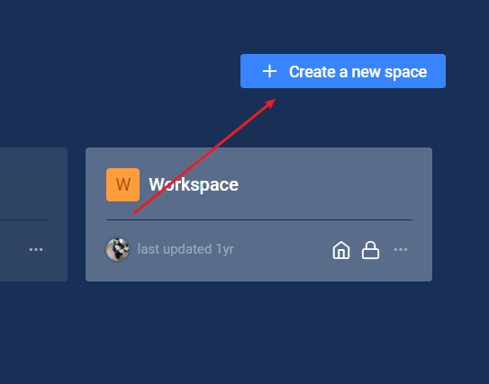
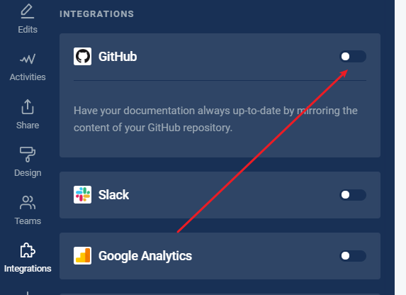
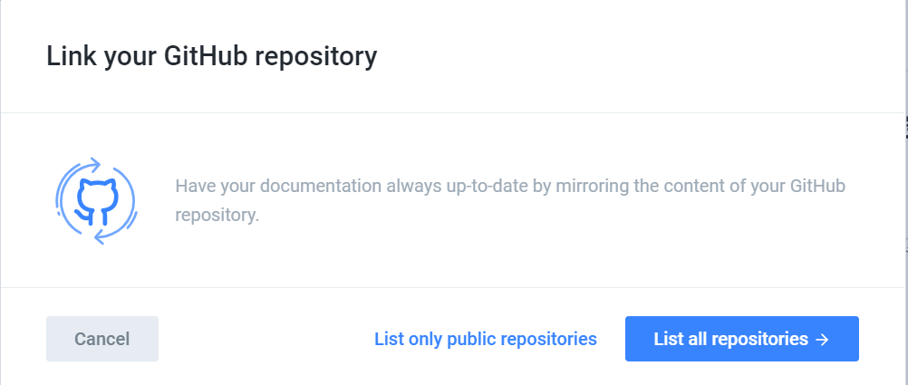
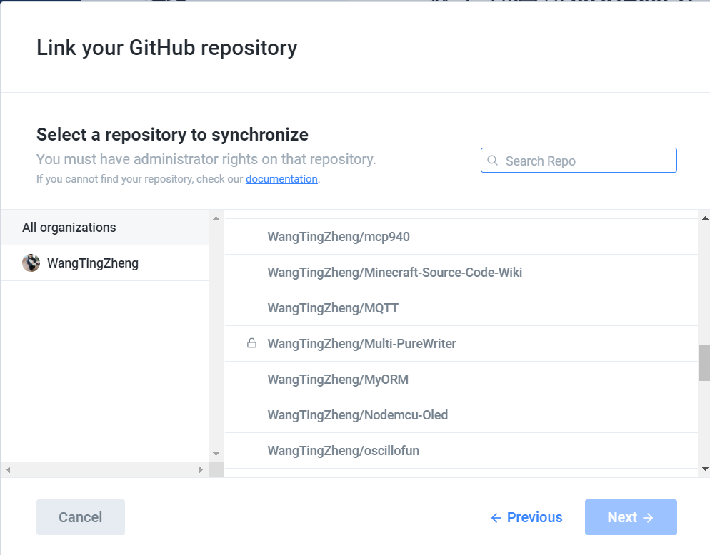
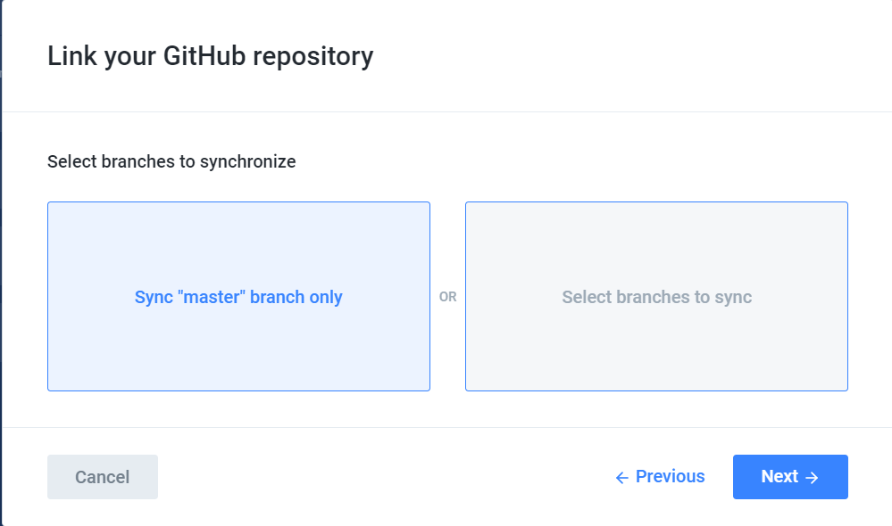
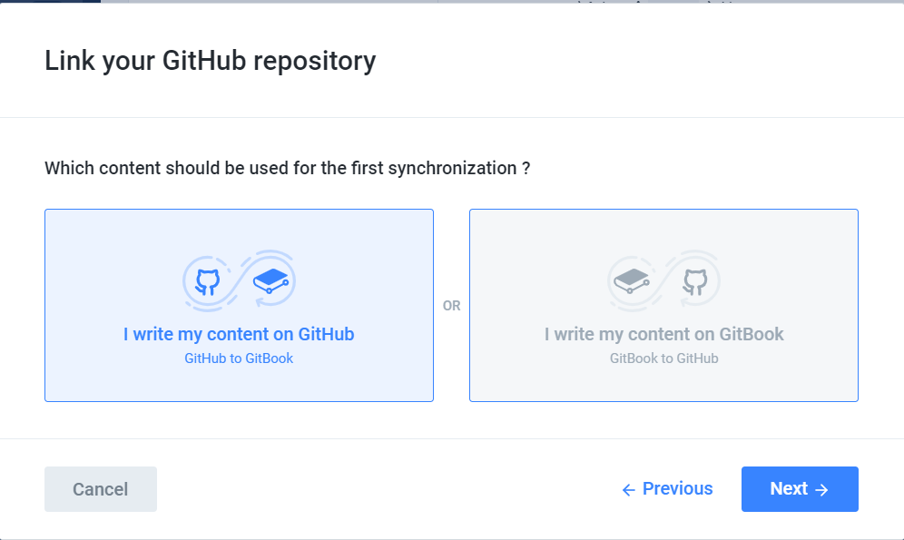
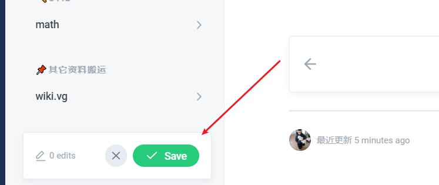
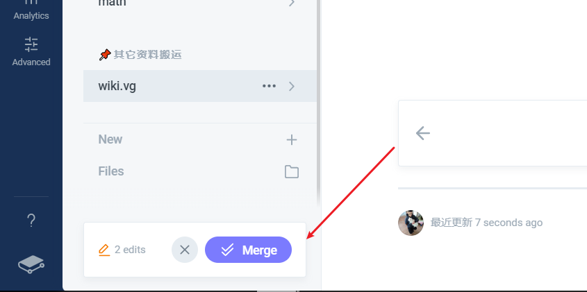
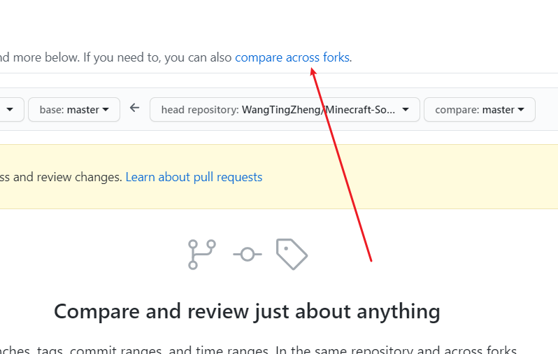

# 编写本Wiki

## 准备

* 注册[Github](https://github.com)账号
* 注册[Gitbook](https://www.gitbook.com/)账号（以Github登录）

## 导入项目

* fork走本项目的[源代码](https://github.com/WangTingZheng/Minecraft-Source-Code-Wiki)到你的账号下
* 创建一个叫Minecraft Source Code Wiki的空间

* 开启Github集成

* 列从Github中所有的项目

* 选择刚才fork的项目：Minecraft-Source-Code-Wiki

* 选择导入master分支

* 选择从Github

## 保存与发布

当你改变本项目中的一些内容时，页面左下方会出现保存按钮：

当你保存好所有的改动后，原来的`Save`按钮将会变成`Merge`按钮，此时点击它就会把更新推送到Github上，并供其他人公共地访问：

## 提交更新到本项目

如果你想让你的修改应用到本页面中，你可以点击[这里](https://github.com/WangTingZheng/Minecraft-Source-Code-Wiki/compare) 并点击compare across forks，显示你的更新：

以此来提交一个Pull request，请简要概述一下你所做的工作，我收到你的Pull request将对你的工作进行审核，审核通过后我将把它应用到本页面中，供所有人访问。

