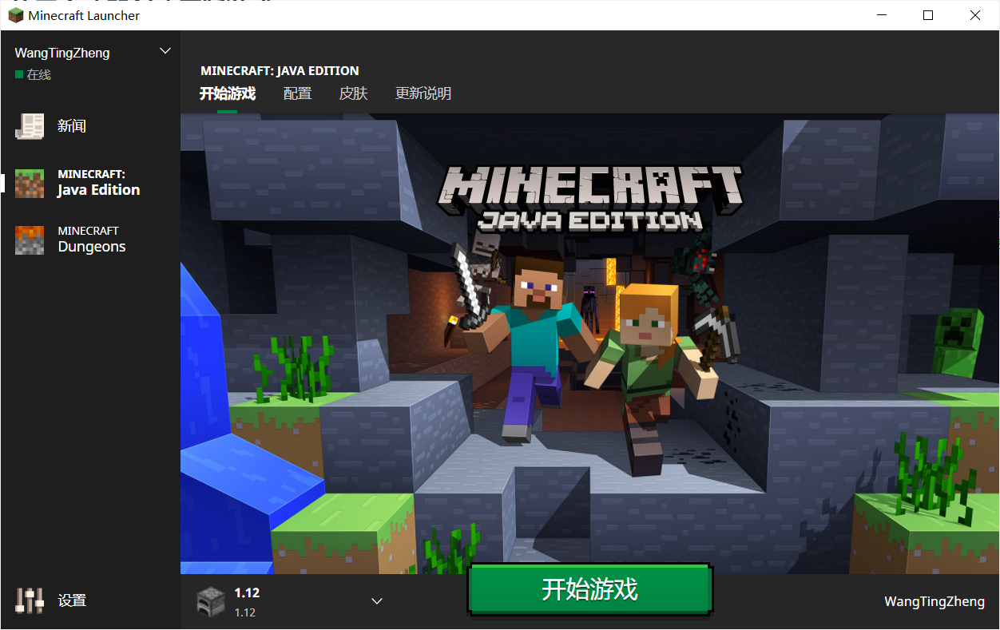
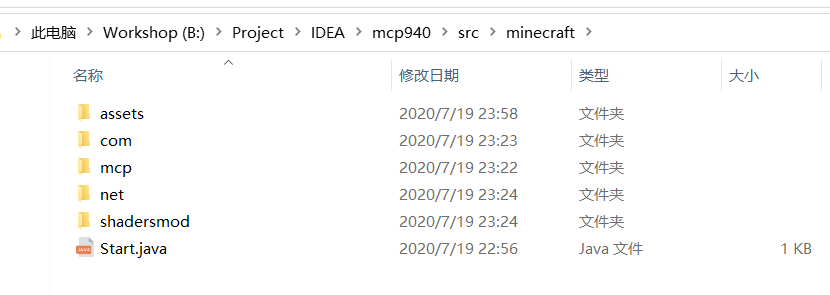

# 编译自己的源码

## 下载源代码以及配套程序









## 使用启动器创建原版游戏

请使用启动器创建一个Minecraft 1.12并开始游戏，启动器我只测试了官方启动器：



请确保

> %HOMEPATH%\AppData\Roaming\.minecraft\versions\1.12

文件夹下有1.12.jar文件

## 反编译Minecraft

解压缩mcp940.zip到你的工作区：

* MacOS/Linux：运行 [decompile.sh](https://github.com/WangTingZheng/mcp940/blob/master/decompile.sh)
* Windows：运行 [decompile.](https://github.com/WangTingZheng/mcp940/blob/master/decompile.sh)

运行成功后，会在`src/minecraft`文件夹下产生net包和一个`Start.java`

## 加入其它工具包

解压缩：

* DarkMagician6-eventapi.zip
* Optifine SRC Version \[1.12 HD U A4\].rar

把解压缩后的内容加入到`src/minecraft`文件夹下，加入好后应该是这样的：



## 加入vecmath依赖

解压缩`vecmath.zip`获得`vecmath.jar`，将它放入`lib`文件夹下

## 在IDEA上配置

在IDEA中，点击：

```c
File-> New-> Project from Existing Sources...
```


选择`Import project from external model`再选择`Eclipse`


接下来一页什么都不干


接下来取消选择Server


一直点击next直到IDEA打开本项目，如果有报错，忽略就好，打开后请配置JDK为1.8

打开`Project Structure`，点击`Modules`，从`lib`加入`vecmath.jar`


运行Start.java内的主函数，你会得到一个报错：

```java
Exception in thread "main" java.lang.UnsatisfiedLinkError: no lwjgl64 in java.library.path
	at java.lang.ClassLoader.loadLibrary(ClassLoader.java:1860)
	at java.lang.Runtime.loadLibrary0(Runtime.java:870)
	at java.lang.System.loadLibrary(System.java:1122)
	at org.lwjgl.Sys$1.run(Sys.java:72)
	at java.security.AccessController.doPrivileged(Native Method)
	at org.lwjgl.Sys.doLoadLibrary(Sys.java:66)
	at org.lwjgl.Sys.loadLibrary(Sys.java:87)
	at org.lwjgl.Sys.<clinit>(Sys.java:117)
	at net.minecraft.client.Minecraft.getSystemTime(Minecraft.java:3282)
	at net.minecraft.client.main.Main.main(Main.java:39)
	at Start.main(Start.java:11)
```

打开Edit Configurations：


配置Start.java的启动参数，在`VM options`中填入`-Djava.library.path=versions\1.12\1.12-natives`，并修改`Working directory`下的最后一个文本为`jars`：


重新执行Start.java下的主函数就可以运行游戏


## 存在的问题

* 缺少国际化，目前只支持英文，无法选择中文
* 整个游戏没有声音、音乐和音效
* 点击资源包，整个游戏就会奔溃

## 参考

* [\[教程\]全民写端-MCP918配置&Optifine装载&EventAPI](https://www.bilibili.com/video/BV1W741127EZ): 使用mcp编译1.8的视频教程
* [mcp940.zip](http://www.modcoderpack.com/): Minecraft 1.12 原版反编译程序，能反编译服务端和客户端
* [Optifine SRC Version \[1.12 HD U A4\]](https://optifinesource.co.uk/downloads/1-12.html): Optifine 包，用来提升游戏帧数
* [DarkMagician6-eventapi.zip](https://bitbucket.org/DarkMagician6/eventapi/downloads/): 一个Minecraft的事件监听api
* [vecmath-1.5.2.jar](https://mvnrepository.com/artifact/javax.vecmath/vecmath/1.5.2): Minecraft中用到的3D向量数学包

