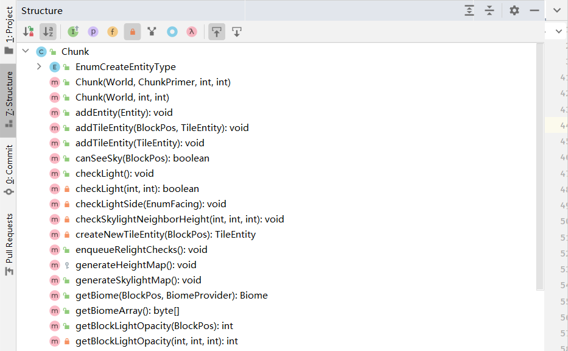
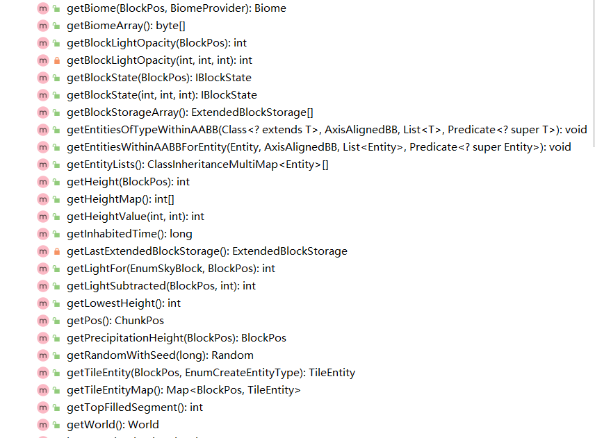

# 阅读源码八原则

* 先看属性后看方法
* 看方法时归类阅读
* 拒绝递归阅读，集中于一个类
* 集中于一个模块，切勿拿了西瓜丢了玉米
* 实践出真知，运行游戏验证你的想法
* 多做注释、多写文档
* 多向他人讲解你学到的知识
* 通过阶段性的项目巩固你的学习成果

### 先看属性后看方法

Minecraft是使用Java编写的，作为一门面向对象的编程语言，类是代码的最小单位，一个类一般由属性和方法组成，属性储存数据，描述类的性质，方法定义方法，操作属性，参与与其它类的交互。所以在阅读一个类时必定先看属性后看方法。

我们首先来看看一个类的属性，我们可以看到，mcp对绝大部分的属性进行了注释，通过这些注释，结合Minecraft的玩法，我们需要了解每一个属性的情况，那么我们应当如何阅读一个属性呢？

* 先看属性的注释，从注释中了解这个属性的大概用处
* 再看属性的类型，看属性的类型主要看两部分：
  * 属性的类是什么，如果你不熟悉这个类，可以按住`Ctrl`键然后点击类名，进入这个类，然后大概浏览一下这个类是干嘛的
  * 如果一下子看不懂，前往别硬看，你可以使用搜索引擎搜索这个类的关键词，一般你能在知乎，mcbbs，csdn，GitHub等地方搜索到别人对这个类的解释
  * 再看属性的数据结构，看看它是数组还是Map
* 再看类中的方法

在IDEA中，左边的侧边栏有一个叫`Structure`的按钮，点击它，IDEA将向你展示编辑器中的类的所有的枚举类型、类、属性和方法：



你可以点击上方的各个图标激活/取消各种功能，你可以通过点击一个黄色的写着`f`的图标取消属性的显示，只看方法（当然会显示枚举类型，但是可以忽略），你还可以点击第二个图标，带箭头和a，z的那个来以首字母排序整个类的方法，你还应该点击激活第六个图标，带锁的那一个来显示不是public的方法，这样你就可以以它为导航，阅读类里的方法了。

### 归类阅读

上面我们已经对整个类里的方法以首字母进行了排序，现在我们可以归类阅读方法了，我们看到，经过排序，此类里的所有get方法都已经放在了一起。我们先从get方法开始。



我们知道，一个get方法大概是这样的：

```java
public IBlockState getBlockState(final int x, final int y, final int z)
{
    //do something
    return blockStateObject;
} 
```

* 对于功能来讲，get方法一般是通过传入某些值（也可以不传），经过一些列操作，获取需要的对象
* 对于函数名字，一般是`get`+想拿到的东西，比如说我想要个方块状态对象，那我就取名`getBlockstate`
* 对于参数，我们一般会传入一些获得对象所需要的参数，就像你去买零食得拿着钱去一样，当然也可以不传
* 对于函数体，一般是一些列能把输入值转化为所需要值的操作
* 对于返回值一般是想要的对象

所有的get方法都是一样的格式，我们一起看get方法的话只需要关心这么一套思路就行，这样我们会更有精力把注意力放在具体的函数体里；还有，一般一个类里的所有get方法的集合，刚好是实现从这个类里获得它所有的类属性。所以归类阅读方法是很有必要的。

### 拒绝递归阅读

在一个类的方法中，常常会引入其它类的对象，我们在阅读函数体的时候，如果不搞清除这些类的对象和对象的方法的话，我们就不能理解整个函数，所以我们通常需要去这个类的定义或者这个类的用到的方法的具体实现内看看，这里我们容易犯一个错误，就是一定要逼迫自己看懂一个类或一个方法的具体实现才肯跳回来，我们可以想象，其它类和其它类的方法中肯定有可能含有不是本类的对象和方法，如果你还是遵循着这么一种递归阅读的方法的话，你将很难完整阅读完一个类，这很容易导致阅读者产生厌烦的情绪，因为你看了这么久，会发现连一个完整的方法都没看懂，不容易产生正循环，所以我们应当适可而止，拒绝递归阅读。

我们应当给递归设定一个清晰的界限，我们必须得明确一个目标，那就是我们应当全力摸透一个类，所以我们规定：

* 只有当阅读本类的时候，才关心一个方法的具体实现
* 如果跳转到了一个新的类或者一个新的类的方法，我们只需要关注类的大概含义、用法即可，不用关注其内部的具体实现

只有这样，我们才能集中精力阅读完一个完整的方法。

### 集中于一个模块

Minecraft作为一个商业项目，其代码规模不算小，因此Minecraft被设计者们分成了好几个模块，你可以从包的分类可以看出来，比如world文件夹下的代码主要负责的是地图元素的封装、世界的生成，network下的代码负责联机下的网络通信。每一个模块的代码量都不小，有些人喜欢在多个模块之间反复横跳，我是不赞同的，主要原因如下：

* 每个模块代码量都不小，而且风格迥异，之间风格相差较大，切换的适应成本太高
* 每个模块之间缺乏强联系，之间引用的也较少，如果集中在一个模块下的话，几个类之间会互相引用，阅读的时候能加强记忆
* 在多个模块之间横跳，统一时间内积累的知识不能很快用项目的方式巩固，在别人看完一个模块的时候，你只看了两个模块的各一块，每个模块都不能独当一面，用所学的制作一个完整的项目

### 实践出真知

纸上谈兵终觉浅，人类总是对具体的事物更感兴趣，如果你对某一个具体的技术细节有疑惑，最好的办法就是修改代码，然后在游戏中验证你的猜想。

我们以下面[Chunk.java](https://wangtingzheng.gitbook.io/minecraft-source-code-wiki/world/chunk#get-fang-fa)里的`getPrecipitationHeight`函数为例，讲解如何从实践里，出真知。为了验证我们对该函数的理解，我们修改了代码，并在游戏中实时运行，观察游戏运行的结果是否与我们预想的一致。

### 多做文档整理

看起来会和能写出来是不一样的概念，想必大家上学做题目的时候应该有类似的体验，看着一道题很容易，没动笔钱觉得很容易，当真正做起来，发觉会遇到很多问题。所以在阅读的过程中，不能光看不写，需要做一些文档整理。

文档分为两部分：

* 代码注释和javadoc
* wiki

代码注释和Javadoc类似于文章的批注吧，看一个函数的函数体的某一行时，可以把这一行的作用以及如何实现这个作用写在注释里，这样有利于整个函数的思路的梳理，当阅读完一整个函数后，你可以利用Javadoc为整个函数做注释，讲明白函数的功能，实现的主要思路、各个参数的意义、返回值的意义。

wiki一般是在代码注释和javadoc之后的，一般是在有一些阶段性成果的时候开始的工作，比如说你看完了一个类里的所有的属性和方法，你就应当用wiki的方式阐明整个类的细节。

### 多向他人讲解

你以为你整理完文档后就真正掌握了吗？当你给一个小白讲解你学会的知识的时候，你百分之百会遇到以下两种情况

* 讲着讲着发现自己以前的理解有问题
* 当对方提出一个问题时，你发现你只是知道，但是不清楚是怎么来的

第一种的情况你有可能在做文档的生活出现，但是那个时候你实际上是给你自己讲一遍知识点，所以会有思维定势，之前没注意的点，写文档的时候也很难找到，当你向他人讲解时，他人对知识点的理解不同，他是一个完全独立于你的人，所以很容易跳出思维定势，找出之前不知道的错误。比方说很多时候，我会突然发现我找不到我的眼镜了，当我着急忙慌地找四处找眼镜时，我地同学会笑着对我说：眼镜不是在你鼻梁上吗，还用找吗？这就是与他人交流知识点地价值，没有同学地提醒，我估计得找好一阵子。

第二种情况往往只出现在向他人讲解知识点的时候，我们知道，当我推导一些公式的时候，我们没必要一定要从公理开始推，有些时候借助一些定理（定理一般也是从公理推导而来的）来推导我们的结论，这样更加省事。我们看一个项目的原理也一样，一些功能的实现原理，是建立在其它算法的基础上的，我们自己阅读的时候往往只会关注我们用到的算法，而不会关心算法的具体的实现，当你向一个小白讲解一个功能的原理时，他会对有关内部算法的具体实现更感兴趣，这个时候就会驱使你去了解一些你之前因为**想当然**而忽略的底层实现。我并不是说我们每了解一个知识点的时候都要死磕到底，我只是希望我们能尽量了解地深入一点，很显然，向他人讲解知识点有助于这一点。

### 用成果来巩固成果

此成果非彼成果，前面一个成果是一个具体的项目，说的更通俗一点就是利用学到的系统知识解决一个实际问题，后面一个成果是你学习minecraft源码的阶段性成果。

学习的最高境界就是灵活使用它，使用它解决各种问题，只有在实践中解决问题了，才能证明你掌握了知识，才能体现它的价值，这种**唯解决问题论**是工科领域所要追求的。是工科一切知识的根本目的。所以最后一步到了。

我之所以选择花费大力气阅读Minecraft源码，就是看中了它的**进可攻，退可守**，进，可以学习各个领域的算法，从数学计算，到计算机图形学，再到设计模式，这些都是能给我们带来实际经济效益的知识，因为它们在脱离Minecraft的商业环境中依然有市场，依然能解决实际问题，退，可以学习制作Minecraft的mod，丰富游戏内容，让自己玩游戏更加快乐。前者是较为抽象的，学习的知识都是偏理论的，后者是较为具体的，学习的知识都是偏实践的，实践，又离不开理论的支持。

所以，在学习完Minecraft的一个模块后，你就可以认为你完成了一个模块的学习，你就可以通过实践，也就是制作一些程序来巩固你的阶段性成果了。

比如在写这篇文章时，我正在看**world**这个模块，也就是地图元素的组织方式（从Block到Section，再到Chunk，再到World）、地形的生成、实体、降水、光线的更新。那么当我完成这个模块后，我就可以做两个项目来巩固我学习的知识：

* 制作一个mod，使玩家能够在一个范围通过两个点来确定一个长方体，再通过多个立方体确定一个范围，把这个范围内的红石机关、建筑的数据单独保存在一个文件中，在地图的其它地方或者在其它地图内，玩家都可以重新拿出保存的红石机关、建筑来放在新地点上使用，达到红石机关、建筑的复用的效果。
* 制作一个latex插件，能在latex页面内显示一小块可交互的红石机关或建筑，供作者表达自己的思路，用于红石、建筑爱好者向别人说明自己作品的思路。

