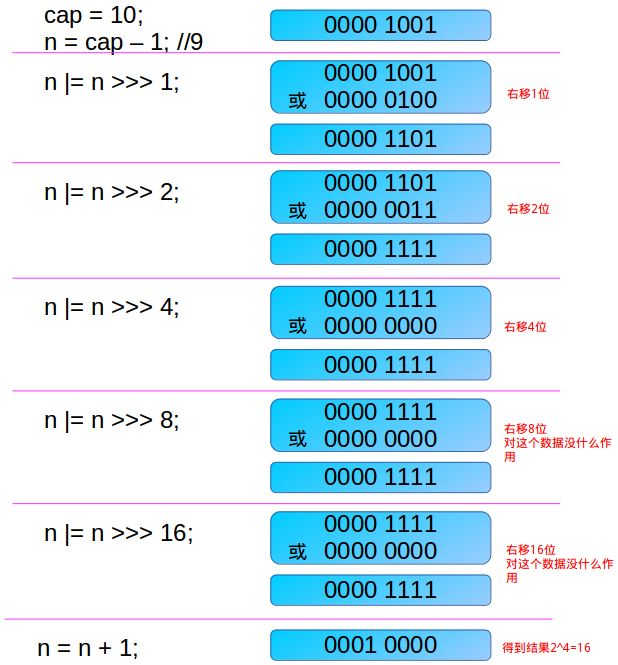

# MathHelper

* 时间：2020-7-21
* 类别：算法
* 类：net.minecraft.util.math.MathHelper

## log2DeBruijn

在类`net.minecraft.world.chunk.BlockStateContainer`中，有一个`setBit`方法，里面有一个给`bits`赋值的过程，这里用到了一个求`log2`的算法：

```java
this.bits = MathHelper.log2DeBruijn(Block.BLOCK_STATE_IDS.size());
```

点开这个方法，发现它被存放在`net.minecraft.util.math.MathHelper`里，内容是这样的：

```java
public static int log2DeBruijn(int value)
{
    value = isPowerOfTwo(value) ? value : smallestEncompassingPowerOfTwo(value);
    return MULTIPLY_DE_BRUIJN_BIT_POSITION[(int)((long)value * 125613361L >> 27) & 31];
}
```

这个方法的作用是输入一个正整数，求得这个正整数的log2，如果不是整数，向上取整，我们发现，其中有一个方法叫`smallestEncompassingPowerOfTwo`，这个方法的作用是根据输入的值，求得一个最小的大于value值，它同时也是2的次幂，它也被存放在MathHelper里，它的内容是这样的：

```java
public static int smallestEncompassingPowerOfTwo(int value)
{
    int i = value - 1;
    i = i | i >> 1;
    i = i | i >> 2;
    i = i | i >> 4;
    i = i | i >> 8;
    i = i | i >> 16;
    return i + 1;
}
```

那么这个函数是如何做到这一点的呢？一篇叫《关于位运算和一个求最小2次幂的算法》 1 的博客讲到了这个问题。我们来看看这幅图：




我们先明确目标，我们要做的是输入一个任意的值，输出一个2的幂次，输入值的特征我们找不到，但是输出值的特征很明显，那就是把它化成二进制，整个字段就只有一个1，就像：

```java
8->00001000
```

那我们就可以把目光转向二进制，然后我们需要做的，就是减少输入值的1的个数直到1个，而且最终的结果只能大于输入值，我们就有了一个思路：

从输入值的第一个1开始，到最右边的那一位，我们想把里面所有的0化成1，我们把输入值看成两部分，一部分是x，是x&lt;=value的最大2的幂次，另外一部分为y，其中y=value-x，我们可以证明x&gt;y，因为如果x&lt;=y，那么y可以重新分为x，y-x两部分，那么value可以分为value=y-x+2x，如果x是2的幂次，那么2x也是2的幂次，这与x为x&lt;=value内最大的2次幂矛盾，故不成立。我们设置不小于value的最小2的幂次为m，这里的x，就是输入值化为二进制后的1的最高值的十进制，那么根据y&lt;x的特点，我们只需要修正1的最高值右边的位中的0为1，就不会导致value&gt;m，这样就不会导致算出的m发生变化，所以我们只需要想办法把1的最高次右边的0改为1就可以。哪么如何改呢？我们知道：`1 AND x = 1`其中x为0或1，所以我们只需要拿一个1按位与上1的最高位右边的位数，但是这个1不能作为单独的1而存在，它得是8位的，这样的话对1的位置就有关系了，在刚开始时，我们应该拿应该在输入值的1的最高次位-1处为1的8进制数，这样的话我们不可能事先定义好，但是我们可以把输入的值右移1位就可以获得了。那有必要一位一位移吗，显然是没必要的，刚开始时，从左到右，第一位本来就是1，第二位在第一步后变成了1，所以你现在有两位1了，你完全可以把这两位1同时移到后面两位上，这样一次与操作就可以解决两位了，类似的，完成4位后就可以右移四位，然后得到了八位1，然后又可以移动8位...一直到移动16位，我们知道int型的变量是32位，16位的移动已经是极限了，如果移动32位，那就相当于没移动。这样我们就可以得到一个全1序列，而且这个序列的最高的1的位置不变，此时要想得到一个不小于输入值的二次幂，只需要加1就可以了，因为全是1，所以加的1会传导到最前面，1的最高次会往前（左）搬移一位，而后面（右边）的位数全是0，这样我们就得到了一个不小于输入值的最小2次幂，但还有一个问题，我们最后加了一个1，为了得到真正的值，我们应当在开头减去1，以达到平衡。

有了这个，我们就能把输入值转化为2的幂次，这样我们离log2value又近了一步，但是我们还是不知道log2value是多少。

我们知道，到了这一步，value的值从二进制角度来讲，它只有1个1，那我们只要找到这个1的位数，不就知道log2value是多少了吗，比如说：

```java
8->00001000
```

1在第4位，那么4-1就刚好是log2\(8\)的结果，这个很好理解，如果i为1的位置的话，value=2^\(i-1\)，那么log2\(value\)=log2\(2^\(i-1\)\)=i-1

所以问题就转化为了如何在一个二进制中找到1的位置，在论文《Using de Bruijn Sequences to index a 1 in a Computer Word》 2中，作者们讨论了这个问题，他们提供了两种方法：

* 相反数相与法
* De Bruijn法

相反数相与法是这样的

我们假设输入是x，输出是y，那么它们的关系是`y = x & (-x)`，只要求出y，就可以求出x中1的位置，我们还是那8来举例子：

```java
8  -> 00001000
-8 -> 100000000
    - 000001000
   -> 11111000
8 and -8 -> 00001000
          & 11111000
            00001000
```

emmm，似乎不太管用，如果输入值里有多个1也许会好一点，这样就能通过一次这样的操作后取得一位（最低的一位）1，减去它后再进行一次操作，又能拿到下一个1。

我们来看看De Bruijn法。说这个方法之前，我们先来聊聊啥是De Bruijn序列，De Bruijn B\(n,k\)序列是指一个由n进制组成的序列，把它每k位分一组，然后不断循环左移（右移）这个序列，单人第一位（最后一位）补到最后一位（第一位）它是一个闭环的，你移动了多少位，分组后也移动了多少位。在一篇叫神奇的德布鲁因序列 3的博客里详尽地介绍了它。

我们举一个B\(2,3\):

```java
00011101-> 000, 001, 011, 111, 110, 101, 010, 100
右移一位 -> 10001110 -> 100, 000, 001, 011, 111, 110, 101, 010
```

利用这样的性质，你可以很快知道移动了多少位，以上面的为例，在8-bit情况下，我右移了一位，而从每三个一组的情况下，它也右移了一组（3位），由于8个组是各不相同的，所以它们能够代表1-8的移动位数，比如说：

| 前3位内容 | 移动位数 |
| :--- | :--- |
| 100 | 1 |
| 010 | 2 |
| 101 | 3 |
| 110 | 4 |
| 111 | 5 |
| 011 | 6 |
| 001 | 7 |
| 000 | 0/8 |

所以我们只需要将移动后的结果的前三位取出来，拿到这张表一查询，就能知道移动了多少位。由这种类似的原理，我们可以使用De Bruijn 来找到1的位置，只需要把要求的值输入这个公式：

$$
h(x)=(x * deBruijn) >> (n -lgn)
$$

这里的n代表De Bruijn序列的长度。lgn刚好是序列每一组的位数，由于x是一个2次幂，所以De Bruijn序列乘以它就相当于左移一定的位数，这个位数刚好是lgx，x乘完De Bruijn序列后，如果这个&gt;&gt;不是闭环右移的话，也就是说，左边空缺的用0来替代的话，右移n-lgn的结果就是拿到乘完后的前lgn位，拿到它后就可以直接代入表中，求得移动位数了，这种方法从头到尾都是左移右移，这是一种很底层的操作，效率很高，所以这种方法的效率还不错。

可能看起来比较抽象，我们拿一个例子，我们用上面的8bit De Bruijn序列00011101，x设定为8，也就是00001000，表格上面也有了。

首先让x乘以De Bruijn序列，也就是把这个序列左移4位：

```java
00011101->10100011
```

然后右移n-lgn=8-3=5位：

```java
10100011->00000101
```

获得序列101，查表可知，101对应的是3，所以求得log2\(8\)=3

至于Minecraft里的log2DeBruijn为什么还要&一个31，那是因为31是11111，而1 & 0 = 0， 1& 1 = 1，输入和输出不会有任何影响，纯粹只是为了把上面求的结果截成5位的，因为Minecraft里给的De Bruijn序列是32位的，数组的下标范围是0-31，也就是00000-11111，刚好能用5位二进制来表示，下标不会溢出。

\[ 1\]   [关于位运算和一个求最小2次幂的算法](https://my.oschina.net/617669559/blog/3043957)

\[ 2\]   [Using de Bruijn Sequences to index a 1 in a Computer Word](https://github.com/WangTingZheng/mcp940/wiki/paper/Using-de-Bruijn-Sequences-to-index-a-1-in-a-computer-word.pdf)

\[ 3\]   [神奇的德布鲁因序列](https://halfrost.com/go_s2_de_bruijn/)

