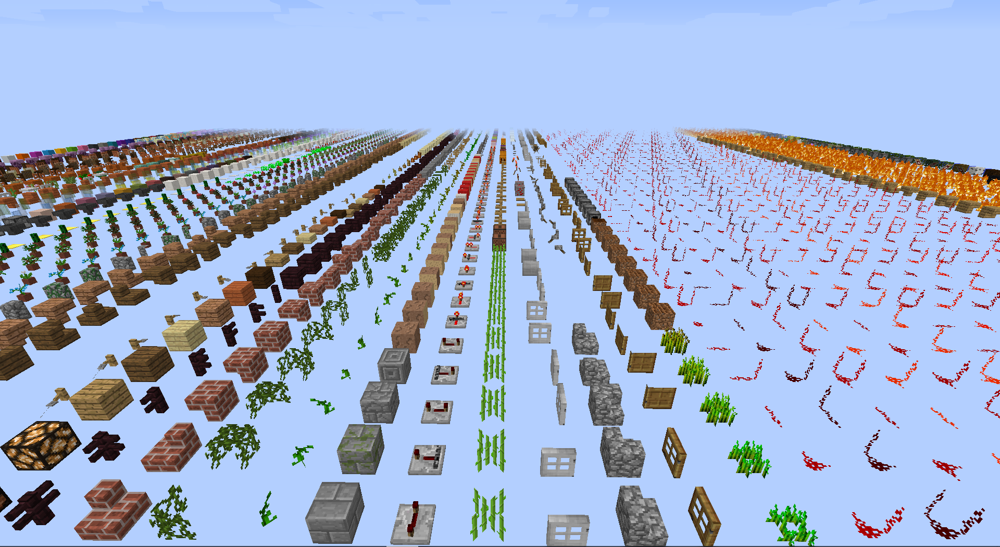

# Chunk

* 时间：2020-8-1
* 类别：地形生成
* 类：net.minecraft.world.chunk.Chunk

## 简介

Chunk是World生成的最小单位，一个World由无数个Chunk组成，而一个Chunk由16个Section垂直排列而成，而一个Section由16×16×16个Block组成。

Chunk.java类是定义Chunk的类。

## 属性

Chunk.java类有以下属性：

```java
public static final ExtendedBlockStorage NULL_BLOCK_STORAGE = null;
private final ExtendedBlockStorage[] storageArrays;
private final byte[] blockBiomeArray;
private final int[] precipitationHeightMap;
private final boolean[] updateSkylightColumns;
private boolean loaded;
private final World world;
private final int[] heightMap;
public final int x;
public final int z;
private boolean isGapLightingUpdated;
private final Map<BlockPos, TileEntity> tileEntities;
private final ClassInheritanceMultiMap<Entity>[] entityLists;
private boolean isTerrainPopulated;
private boolean isLightPopulated;
private boolean ticked;
private boolean dirty;
private boolean hasEntities;
private long lastSaveTime;
private int heightMapMinimum;
private long inhabitedTime;
private int queuedLightChecks;
private final ConcurrentLinkedQueue<BlockPos> tileEntityPosQueue;
public boolean unloadQueued;
```

我们一个个来看，在看某一个类时候，按照我们的阅读原则，我们应当关系一个属性的两个东西：

* 对象所属的父类
* 属性的数据结构

具体的细节请看[阅读源码八原则](./%E9%98%85%E8%AF%BB%E6%BA%90%E7%A0%81%E5%85%AB%E5%8E%9F%E5%88%99#%E5%85%88%E7%9C%8B%E5%B1%9E%E6%80%A7%E5%90%8E%E7%9C%8B%E6%96%B9%E6%B3%95)。

* NULL\_BLOCK\_STORAGE
  * 父类：ExtendedBlockStorage，这个父类是描述一个Section的类
  * 数据结构：普通变量
  * 含义：是一个空Section，注意，不是充满空气的Section，而是没有保存的Section，也就是Section对象是空的
  * 用途：通过判断一个Section对象与它是否相等来判断它是不是空Section
* storageArrays
  * 父类：ExtendedBlockStorage，这个父类是描述一个Section的类
  * 数据结构：16长度的一维数组
  * 含义：储存本Chunk中所有16个Section的数组
  * 用途：保存一个Chunk的所有Block
* blockBiomeArray
  * 父类：byte
  * 数据结构：256长度的一维数组
  * 含义：本Chunk中保存的256（16×16）列所属的生物群系id
  * 用途：保存一个Chunk的所有生物群系id
* precipitationHeightMap
  * 父类：int
  * 数据结构：256长度的一维数组
  * 含义：本Chunk中保存的256（16×16）列中的降水高度数据，下雨时雨滴会在这个高度停下并在这个高度的下表面产生蓝色的粒子特效
  * 用途：指导降水粒子停止运动，指导降水碰撞粒子特效的产生
* updateSkylightColumns
  * 父类：boolean
  * 数据结构：256长度的一维数组
  * 含义：本Chunk中保存的256（16×16）列是否要更新天光（全局光照）的标志位
  * 用途：指导OpenGL更新Chunk列的天光渲染
* loaded
  * 父类：boolean
  * 数据结构：普通变量
  * 含义：标识本Chunk是否被加载的标志位，为了运行效率，Minecraft并不会同时加载地图中所有的Chunk
  * 用途：指导OpenGL在适当的时候加载Chunk
* world
  * 父类：World
  * 数据结构：普通变量
  * 含义：标识本Chunk所在的世界，世界有很多，有Overworld（主世界），end（末地）
  * 用途：从主世界获得一些光照数据，执行一些渲染动作之类的
* heightMap
  * 父类：int
  * 数据结构：256长度的一维数组
  * 含义：本Chunk中保存的256（16×16）列的高度，也就是最高的非空气方块的y坐标
  * 用途：涉及一些光线的计算、降水高度的判定
* x
  * 父类：int
  * 数据结构：普通变量
  * 含义：本Chunk在所处世界的x坐标
  * 用途：用于定位一个Chunk
* y
  * 父类：int
  * 数据结构：普通变量
  * 含义：本Chunk在所处世界的y坐标
  * 用途：用于定位一个Chunk
* isGapLightingUpdated
  * 父类：boolean
  * 数据结构：普通变量
  * 含义：暂时不清楚
  * 用途：暂时不清楚
* tileEntities
  * 父类：&lt;BlockPos, TileEntity&gt;
  * 数据结构：Map&lt;BlockPos, TileEntity&gt;
  * 含义：平铺实体，比如说宝箱
  * 用途：储存Chunk中的平铺实体
* entityLists
  * 父类：Entity
  * 数据结构：16长度的ClassInheritanceMultiMap数组
  * 含义：实体列表，比如说一些mob（怪物）
  * 用途：储存Chunk中的实体
* isTerrainPopulated
  * 父类：boolean
  * 数据结构：普通变量
  * 含义：暂时不清楚
  * 用途：暂时不清楚
* isLightPopulated
  * 父类：boolean
  * 数据结构：普通变量
  * 含义：暂时不清楚
  * 用途：暂时不清楚
* ticked
  * 父类：boolean
  * 数据结构：普通变量
  * 含义：暂时不清楚
  * 用途：暂时不清楚
* dirty
  * 父类：Boolean
  * 数据结构：普通变量
  * 含义：Chunk是否是脏的，是否需要更新
  * 用途：指导OpenGL对Chunk进行更新
* hasEntities
  * 父类：boolean
  * 数据结构：普通变量
  * 含义：标识本Chunk中是否有实体
  * 用途：决定是否要在每一个ticked中保存
* lastSaveTime
  * 父类：long
  * 数据结构：普通变量
  * 含义：保存本Chunk上一次保存的时间，保存世界是以游戏内的时间为标准的
  * 用途：当判断是否需要保存时，需要作为判断依据
* heightMapMinimum
  * 父类：Integer
  * 数据结构：普通变量
  * 含义：heightMap保存的256列的高度数据中，最低的值
  * 用途：在World类中的getChunksLowestHorizon函数中被调用，用于获取阳光直接到达的块的最低高度，或许与太阳落山/升起时的光线计算有关
* inhabitedTime
  * 父类：Long
  * 数据结构：普通变量
  * 含义：有人居住的时间，本质上是玩家在这个Chunk停留的ticked数
  * 用途：可能决定了怪生成的概率之类的东西
* queuedLightChecks;
  * 父类：Integer
  * 数据结构：普通变量
  * 含义：当前游戏循环中需要检查光线的方块的数量
  * 用途：用于更快地更新Chunk方块，具体的过程暂时未知
* tileEntityPosQueue;
  * 父类：BlockPos
  * 数据结构：ConcurrentLinkedQueue
  * 含义：以Queue方式创建实体时，排队等待的实体
  * 用途：保存本Chunk中要被创建的实体
* unloadQueued
  * 父类：Boolean
  * 数据结构：普通变量
  * 含义：标识本Chunk是否在卸载队列中
  * 用途：卸载Chunk时作为判断依据

## 方法

### get

```java
public Biome getBiome(BlockPos pos, BiomeProvider provider)
public byte[] getBiomeArray()
public int getBlockLightOpacity(BlockPos pos)
private int getBlockLightOpacity(int x, int y, int z)
```

### **getBiome**

```java
/**
* 取本Chunk中的某一个方块上的生物，如果无效，就返回BiomeProvider中的生物
* @param pos 本Chunk中的某一个方块的坐标对象
* @param provider 如果获取失败，应当放回的默认生物值
* @return 从Chunk获得的生物对象
*/
public Biome getBiome(BlockPos pos, BiomeProvider provider)
{
    int i = pos.getX() & 15; //获取方块的x坐标，与上15，使之在一个chunk内
    int j = pos.getZ() & 15; //获取方块的z坐标，与上15，使之在一个chunk内
    int k = this.blockBiomeArray[j << 4 | i] & 255; //获取一个点的生物群系id
​
    if (k == 255) //
    {
        Biome biome = provider.getBiome(pos, Biomes.PLAINS);  //从坐标里获得生物群系，默认群系为平原
        k = Biome.getIdForBiome(biome); //获得生物群系id
        this.blockBiomeArray[j << 4 | i] = (byte)(k & 255); //重新赋值生物群系id
    }
​
    Biome biome1 = Biome.getBiome(k); //获得生物群系
    return biome1 == null ? Biomes.PLAINS : biome1; //返回生物群系，如果是空，返回默认的平原
}
```

首先通过`pos`对象中获得方块的x轴和z轴坐标，`&15`是因为传进来的位置是全地图的坐标，而我们是通过某个Chunk获取的，所以x轴和z轴的坐标不能超过15，所以要这么做。获得x轴和z轴坐标后，通过`j << 4 | i`来获得这个方块在底面的序号，因为一个Chunk的16×16的列的生物id数据是存放在一个256长度的数组里的，所以要把二维的坐标转化为一维的序号。通过`blockBiomeArray`这个数组，获得了传入方块所在列的生物群系id。

在Chunk的构造函数中，初始化`blockBiomeArray`数组的时候，赋的初值就是`(byte)-1`，而上面为了获得生物群系id的时候，通过了`& 255`来转化为int类型了，-1结果这个处理后，也就是：

```java
(byte) -1 & 255
```

结果是255，所以如果`k`的值是255的话，说明生物群系id只结果初始化，没有有意义的值，所以不能直接返回Chunk提供的生物群系，所以需要从`BiomeProvider`对象中获得生物群系。

先从provider中通过getBiome函数传入方块位置对象pos，同时传入一个默认生物群系：平原，出现问题无法获得时，返回平原生物群系，获得生物群系对象后通过`getIdForBiome`函数转化为生物群系id，再传入`blockBiomeArray`数组进行更新，这样就能获得准确的生物群系对象。

更新完准确的生物群系id后，就可以正常获取了，首先通过id得到生物群系对象，再返回，当对象是空的时候，返回默认的生物群系：平原。

### **getBiomeArray**

```java
/**
 * Returns an array containing a 16x16 mapping on the X/Z of block positions in this Chunk to biome IDs.
 * 返回Chunk中保存的16*16列的生物群系id数组
 * @return
 */
public byte[] getBiomeArray()
{
    return this.blockBiomeArray;
}
```

其实就是一个普通的get函数，没什么好讲的。

### **getBlockLightOpacity**

```java
/**
 * 返回特定坐标的方块的不透明度
 * @param pos 方块坐标对象
 * @return 方块不透明度
*/
public int getBlockLightOpacity(BlockPos pos)
{
    return this.getBlockState(pos).getLightOpacity(); //通过位置获得所在方块的方块状态对象，再从这里获得方块不透明度
}
```

方块光线不透明度封装在方块状态类里，而方块状态对象通过本类中`getBlockState`函数来获取。

### **getBlockLightOpacity**

```java
/**
 * 返回特定坐标的方块的不透明度
 * @param x x坐标值
 * @param y y坐标值
 * @param z z坐标值
 * @return 方块不透明度
*/
private int getBlockLightOpacity(int x, int y, int z)
{
    return this.getBlockState(x, y, z).getLightOpacity();
}
```

与上面的函数类似，只不过传入方块的位置参数不同，上一个是传入封装好的位置对象，这一个是直接传入方块的三维坐标。

### **getBlockState**

```java
/**
 * 返回地图中特定坐标的方块对象
 * @param x x坐标值
 * @param y y坐标值
 * @param z z坐标值
 * @return IBlockState对象
*/
public IBlockState getBlockState(final int x, final int y, final int z)
{
    if (this.world.getWorldType() == WorldType.DEBUG_ALL_BLOCK_STATES) //如果世界的类型是调试模式
    {
        IBlockState iblockstate = null;
​
        if (y == 60) //debug模式中的障碍层
        {
            iblockstate = Blocks.BARRIER.getDefaultState(); //这一层全是障碍方块，直接返回障碍方块
        }
​
        if (y == 70) //debug的展示层
        {
            iblockstate = ChunkGeneratorDebug.getBlockStateFor(x, z);  //从debug模式获取展示的方块
        }
​
        return iblockstate == null ? Blocks.AIR.getDefaultState() : iblockstate; //空方块以空气方块填充
    }
    else //如果不是debug模式
    {
        try
        {   //如果在基岩上面而且方块所在section的id小于本区块的section的数目，也就是16
            if (y >= 0 && y >> 4 < this.storageArrays.length) 
            {
                ExtendedBlockStorage extendedblockstorage = this.storageArrays[y >> 4]; //获取方块所在section
​
                if (extendedblockstorage != NULL_BLOCK_STORAGE)
                {
                    return extendedblockstorage.get(x & 15, y & 15, z & 15); //获取坐标所指向的方块对象
                }
            }
​
            return Blocks.AIR.getDefaultState(); //如果找不到，返回默认值空气
        }
        catch (Throwable throwable)
        {
            CrashReport crashreport = CrashReport.makeCrashReport(throwable, "Getting block state");
            CrashReportCategory crashreportcategory = crashreport.makeCategory("Block being got");
            crashreportcategory.addDetail("Location", new ICrashReportDetail<String>()
            {
                public String call() throws Exception
                {
                    return CrashReportCategory.getCoordinateInfo(x, y, z);
                 }
            });
            throw new ReportedException(crashreport);
        }
    }
}
```

如果这个世界是debug模式的话，执行下面的代码，所谓debug模式，就是把本版本的所有物品平铺在一层上，供开发者调试，它只有两层，一层是y=60的障碍层，是为了阻止玩家往下移动，还有一层是y=70的物品展示层，平铺着所有的物品，每个物品与其它物品之间有空气隔离。debug模式实图如下：



```java
IBlockState iblockstate = null;

if (y == 60) //debug模式中的障碍层
{
    iblockstate = Blocks.BARRIER.getDefaultState(); //这一层全是障碍方块，直接返回障碍方块
}

if (y == 70) //debug的展示层
{
    iblockstate = ChunkGeneratorDebug.getBlockStateFor(x, z);  //从debug模式获取展示的方块
}

return iblockstate == null ? Blocks.AIR.getDefaultState() : iblockstate; //空方块以空气方块填充
```

当传入的方块的y轴坐标等于60时，说明取得是障碍层，那就直接把障碍方块的默认的状态赋值给方块状态对象。当y轴坐标等于70时，说明是展示层，那就使用`ChunkGeneratorDebug`类中的`getBlockStateFor`方法获得对应位置的方块对象。最后还得处理好空指针的问题，当传入的y轴既不是60也不是70的话，iblockstate是空的，就应该返回空气方块的默认状态。

如果不是debug模式的话，执行下面的代码：

```java
try
{   //如果在基岩上面而且方块所在section的id小于本区块的section的数目，也就是16
    if (y >= 0 && y >> 4 < this.storageArrays.length) 
    {
        ExtendedBlockStorage extendedblockstorage = this.storageArrays[y >> 4]; //获取方块所在section

        if (extendedblockstorage != NULL_BLOCK_STORAGE)
        {
            return extendedblockstorage.get(x & 15, y & 15, z & 15); //获取坐标所指向的方块对象
        }
    }
    return Blocks.AIR.getDefaultState(); //如果找不到，返回默认值空气
}
catch (Throwable throwable)
{
    CrashReport crashreport = CrashReport.makeCrashReport(throwable, "Getting block state");
    CrashReportCategory crashreportcategory = crashreport.makeCategory("Block being got");
    crashreportcategory.addDetail("Location", new ICrashReportDetail<String>()
    {
    	public String call() throws Exception
        {
        	return CrashReportCategory.getCoordinateInfo(x, y, z);
        }
    });
    throw new ReportedException(crashreport);
}
```

首先来个判断，如果方块的y轴坐标大于等于0且y轴坐标所在Section的id在范围之内，也就是方块的位置不高也不低，处于正常的位置时，先从`storageArrays`获得方块所在的Section，如果Section对象不为空的话，通过`ExtendedBlockStorage`类中的get方法获取方块状态对象，如果不满足条件，就返回空气。

### **getBlockState**

```java
/**
 * 以BlockPos方式传入方块坐标
 * @param pos 方块坐标对象
 * @return IBlockState方块状态对象
*/
public IBlockState getBlockState(BlockPos pos)
{
    return this.getBlockState(pos.getX(), pos.getY(), pos.getZ());
}
```

再次封装函数`public IBlockState getBlockState(final int x, final int y, final int z)`，只传入封装方块位置的BlockPso对象。

### **getBlockStorageArray**

```java
/**
 * Returns the ExtendedBlockStorage array for this Chunk.
 * 从chunk返回section列表
*/
public ExtendedBlockStorage[] getBlockStorageArray()
{
    return this.storageArrays;
}
```

返回本Chunk保存的Section数组。没什么好讲的。

### **getEntitiesOfTypeWithinAABB**

```java
/**
 * @param entityClass 
 * @param aabb
 * @param listToFill
 * @param filter
 * @param <T>
*/
public <T extends Entity> void getEntitiesOfTypeWithinAABB(Class <? extends T > entityClass, AxisAlignedBB aabb, List<T> listToFill, Predicate <? super T > filter)
{
    int i = MathHelper.floor((aabb.minY - 2.0D) / 16.0D);
    int j = MathHelper.floor((aabb.maxY + 2.0D) / 16.0D);
    i = MathHelper.clamp(i, 0, this.entityLists.length - 1);
    j = MathHelper.clamp(j, 0, this.entityLists.length - 1);

    for (int k = i; k <= j; ++k)
    {
        for (T t : this.entityLists[k].getByClass(entityClass))
        {
            //如果选到的区域与aabb重叠且通过了过滤
            if (t.getEntityBoundingBox().intersects(aabb) && (filter == null || filter.apply(t))) 
            {
                listToFill.add(t); //就把它加入到列表中
            }
        }
    }
}
```

还未知。

### **getEntitiesWithinAABBForEntity**

```java
/**
 * Fills the given list of all entities that intersect within the given bounding box that aren't the passed entity.
 * 填充给定边界框内相交但不是传递实体的所有实体的给定列表。
 * @param entityIn   
 * @param aabb
 * @param listToFill
 * @param filter
*/
public void getEntitiesWithinAABBForEntity(@Nullable Entity entityIn, AxisAlignedBB aabb, List<Entity> listToFill, Predicate <? super Entity > filter)
{
    int i = MathHelper.floor((aabb.minY - 2.0D) / 16.0D);
    int j = MathHelper.floor((aabb.maxY + 2.0D) / 16.0D);
    i = MathHelper.clamp(i, 0, this.entityLists.length - 1);
    j = MathHelper.clamp(j, 0, this.entityLists.length - 1);

    for (int k = i; k <= j; ++k)
    {
        if (!this.entityLists[k].isEmpty())
        {
            for (Entity entity : this.entityLists[k])
            {
                if (entity.getEntityBoundingBox().intersects(aabb) && entity != entityIn)
                {
                    if (filter == null || filter.apply(entity))
                    {
                        listToFill.add(entity);
                    }

                    Entity[] aentity = entity.getParts();

                    if (aentity != null)
                    {
                        for (Entity entity1 : aentity)
                        {
                            if (entity1 != entityIn && entity1.getEntityBoundingBox().intersects(aabb) && (filter == null || filter.apply(entity1)))
                            {
                                listToFill.add(entity1);
                            }
                        }
                    }
                }
            }
        }
    }
}
```

未知。

### **getEntityLists**

```java
/**
 * 返回实体列表map
 * @return 本Chunk中的实体列表map
*/
public ClassInheritanceMultiMap<Entity>[] getEntityLists()
{
    return this.entityLists;
}
```

返回本Chunk中的实体列表map，没什么好讲的

### **getHeightValue**

```java
/**
 * Returns the value in the height map at this x, z coordinate in the chunk
 * 获取x，z的地形高度
*/
public int getHeightValue(int x, int z)
{
    return this.heightMap[z << 4 | x]; //把x,z转化为0-255的值，也就是说找到一个方块的坐标，转化为它的序号
}
```

从heightMap中获取某一个列的高度，传入x轴和z轴的坐标，把x和z轴坐标通过`z << 4 | x`转化为序号，在从heightMap检索列高度。

### **getHeight**

```java
/**
 * 从方块坐标获得方块高度，由于方块坐标不一定在0-15之间，所以需要取&来保证
 * @param pos 方块坐标
 * @return 高度
*/
public int getHeight(BlockPos pos)
{
    return this.getHeightValue(pos.getX() & 15, pos.getZ() & 15);
}
```

封装上面的函数，传入封装好的方块的位置对象，返回方块所在列的高度。

### **getHeightMap**

```java
/**
 * 返回本Chunk中16*16方块的列的高度数组
 * @return 256长度的列高度数组
*/
public int[] getHeightMap()
{
    return this.heightMap;
}
```

返回本Chunk中16\*16方块的列的高度数组heightMap，没啥可说的。

### **getInhabitedTime**

```java
/**
 * 返回玩家在本Chunk中呆的时间
 * @return 玩家待的时间
*/
public long getInhabitedTime()
{
    return this.inhabitedTime;
}
```

返回玩家在本Chunk中呆的时间，没什么好讲的。

### **getLastExtendedBlockStorage**

```java
/**
 * 获得最上面的非空section
 * @return section对象
*/
@Nullable
private ExtendedBlockStorage getLastExtendedBlockStorage()
{
    for (int i = this.storageArrays.length - 1; i >= 0; --i)  //从上到下遍历chunk里的section
    {
        if (this.storageArrays[i] != NULL_BLOCK_STORAGE) //如果此section非空
        {
            return this.storageArrays[i]; //就返回该section
        }
    }

    return null; //如果没找到，就返回空
}
```

要获得最上面的非空section，肯定得从上面开始检查，所以有一个从上往下的遍历的for循环，从`storageArrays`中遍历`ExtendedBlockStorage`对象，如果section对象不是空的，就返回该section对象，那就是最上面的非空section。

### **getLightFor**

```java
/**
 * 根据方块类型返回亮度
 * 如果是空的，返回默认值
 * 如果是天空，返回全局光照
 * 如果是方块，返回局部光照
 * @param type 方块类型
 * @param pos 坐标对象
 * @return 亮度值
*/
public int getLightFor(EnumSkyBlock type, BlockPos pos)
{
    int i = pos.getX() & 15; //取 0-15之间，也就是一个section底面以内
    int j = pos.getY();
    int k = pos.getZ() & 15; //取 0-15之间，也就是一个section底面以内
    ExtendedBlockStorage extendedblockstorage = this.storageArrays[j >> 4]; //得到所在section

    if (extendedblockstorage == NULL_BLOCK_STORAGE)
    {
        //如果能看见天空，就返回默认的光亮值，如果看不见，就返回0
        return this.canSeeSky(pos) ? type.defaultLightValue : 0; 
    }
    else if (type == EnumSkyBlock.SKY)
    {
        //从section获得sky light
        return !this.world.provider.hasSkyLight() ? 0 : extendedblockstorage.getSkyLight(i, j & 15, k);
    }
    else
    {
        return type == EnumSkyBlock.BLOCK ? extendedblockstorage.getBlockLight(i, j & 15, k) : type.defaultLightValue;//如果是一个block，就从block处返回局部光照，否则返回默认的光照
    }
}
```

