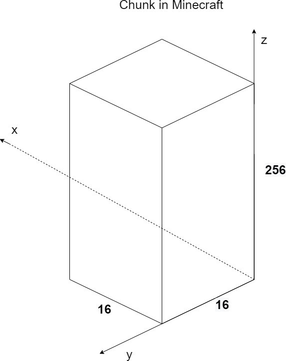

# ChunkPrimer

* 时间：2020-7-16
* 类别：地形生成
* 类：net.minecraft.world.chunk.ChunkPrimer

先导知识，在Java中：

* `a<<b` 的意思是把a转化为二进制，然后再左移b位，相当于`a·2^b`再化为十进制
* `a|b`的意思是把a和b化为二进制，然后按位做或操作，结果再转回十进制

```java
private static int getBlockIndex(int x, int y, int z)
{
    return x << 12 | z << 8 | y;
}
```

在下面这个式子中：

```java
x << 12 | z << 8 | y;
```

相当于

```java
x·4096|z·256|y
```

这有什么特点呢?我们假设x和z的值保持不变, y的值加一,似乎总体的值总是加一,如果是x和y保持不变, z加一,那么总体的值加256,如果是z和y不变, x加一, 那么总体值将加4096。我们映射到一个长方体上，x, y, z是长宽高。按照上面的意思，长宽不变,高增加1,也就是往上数- -层，也就是x和不变，z加一,那么结果将增加256,那就说明水平的一-层有256个方块,如果长和高不变,宽增加1,也就是x，z不变, y增加1,总体将增加1,这就意味着，-层的方块是沿y轴标数的，如果是宽和高不变,也就是y, z不变, x增加1,总体将增加4096,也就是说这个长方体的一个侧边有4096个方块,那么侧边和底边-定有一边从重合的。

按照目前资料的说法，Minecraft中一 个section由16x16x16个方块\(block\) 组成，-一个chunk由1 6个section垂直堆叠而成，也就是说，这个chunk是一个长宽高分别是16,16,16x16的长方体,也就是它的底面是16\*1 6=256个方块，侧边是16×16×16=4096个方块,这与我们的代码的逻辑相同。-个chunk的样子大概就长这样:



所以这个函数的作用应当是，输入一个方块在一个chunk中的坐标，返回这个方块在这个chunk中的排序，可以看作是这个方块在整个chunk中的一一个唯一标识符。

但是目前我还没法推导当x, y, z中某一个值发生变动导致整 个结果发生变动的规律。

